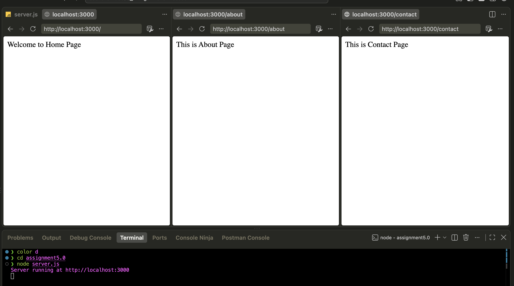
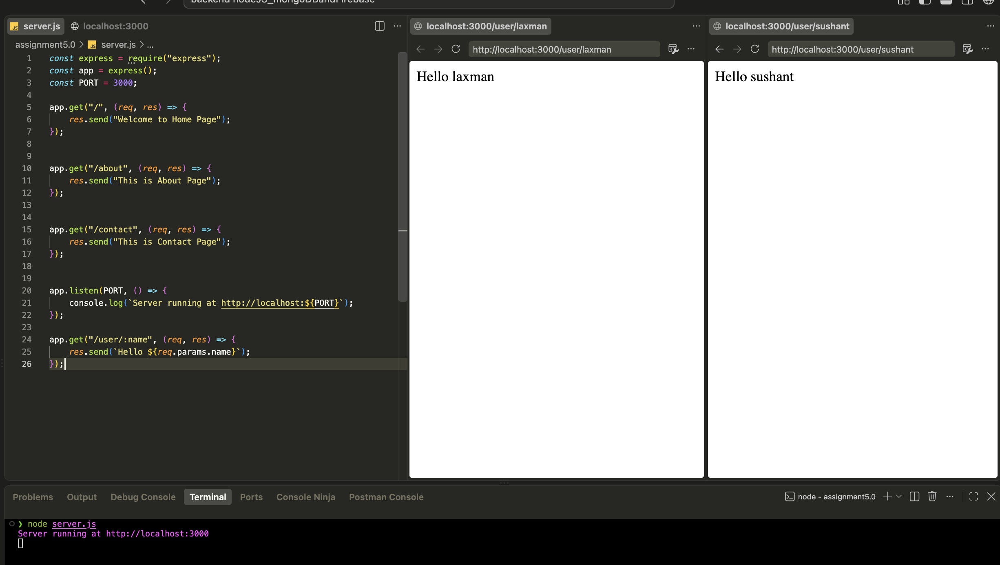
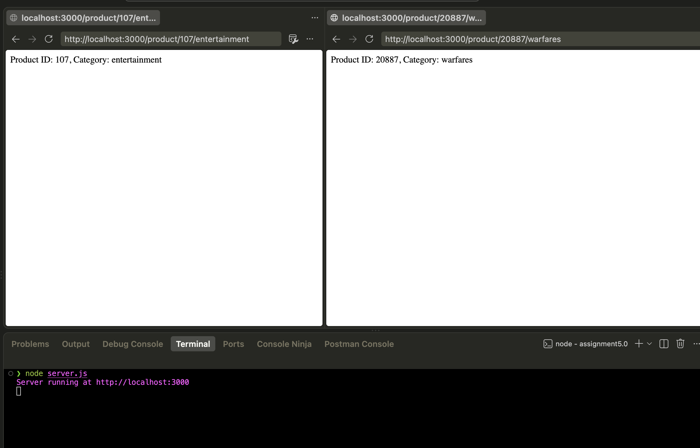
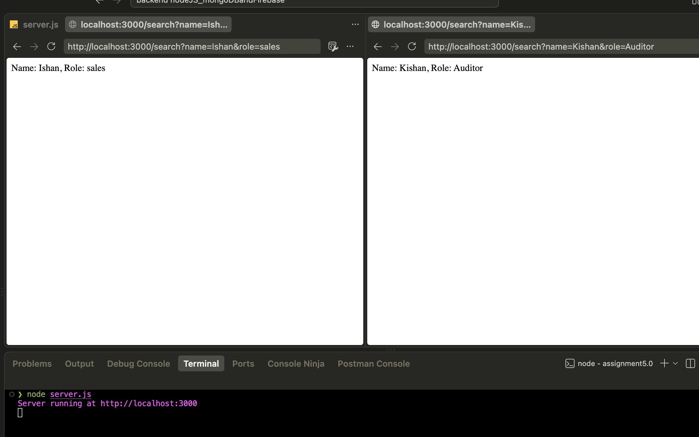
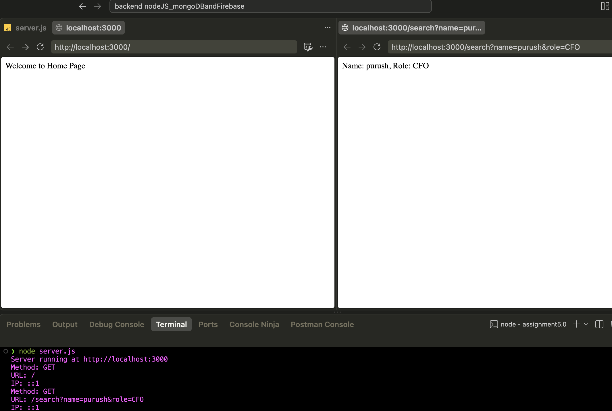

# Assignment 5.0 – Express.js Routing

A basic Express server demonstrating static routes, dynamic route parameters, multiple route parameters, query parameters, and request logging middleware.

## Project Structure

```
assignment5.0/
├── screenshots/
│   ├── pic1.png
│   ├── pic2.png
│   ├── pic3.png
│   ├── pic4.png
│   └── pic5.png
└── server.js
```

## Steps to Run the Server

1. Make sure Node.js is installed (`node -v` to check).
2. In the project folder, initialize npm and install Express:
   ```bash
   npm init -y
   npm install express
   ```
3. Start the server:
   ```bash
   node server.js
   ```
4. You should see:
   ```
   Server running at http://localhost:3000
   ```
5. Open a browser or use a tool like Postman/curl to hit the routes below.

## Explanation of Routes

| Method | Route | Description |
|---|---|---|
| GET | `/` | Returns a welcome message for the home page. |
| GET | `/about` | Returns static text for the About page. |
| GET | `/contact` | Returns static text for the Contact page. |
| GET | `/user/:name` | Dynamic route parameter. `:name` is captured from the URL and returned in the response. |
| GET | `/product/:id/:category` | Multiple route parameters. Captures both `:id` and `:category` from the URL. |
| GET | `/search` | Reads `name` and `role` from the query string (`?name=...&role=...`) rather than the URL path. |

**Middleware:** every incoming request passes through a logging middleware first, which prints the HTTP method, URL, and requester's IP to the terminal before the request reaches its route handler.

**Route parameters vs. query parameters:** `:name` in `/user/:name` is part of the URL path itself (e.g. `/user/John`), accessed via `req.params`. In `/search`, `name` and `role` are appended after a `?` (e.g. `/search?name=John&role=admin`) and accessed via `req.query`. Use path params for identifying a specific resource, query params for optional filters/options.

## Sample Outputs

**1. Home route** – `GET /`


**2. Dynamic route** – `GET /user/John`


**3. Multiple route parameters** – `GET /product/101/electronics`


**4. Query parameters** – `GET /search?name=John&role=admin`


**5. Terminal log** – method, URL, and IP printed by the middleware

