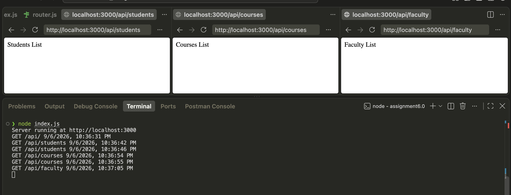
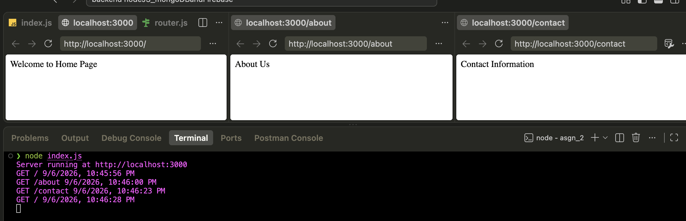

# Assignment 6.0 – Express.js Middleware

Two Express.js exercises demonstrating router-level middleware and application-level (global) middleware, including request logging with method, URL, and timestamp.

## Objectives

- Understand the difference between router-level and application-level middleware.
- Implement a custom logging middleware that runs before route handlers.
- Use `express.Router()` to modularize routes under a common base path.
- Practice `app.use()` vs `router.use()` and the role of `next()` in the middleware chain.

## Project Structure

```
assignment6.0/
├── asgn_1/
│   ├── index.js
│   └── router.js
│
├── asgn_2/
│   └── index.js
│
└── screenshots/
    ├── pic1.png
    └── pic2.png
```

## Technologies Used

- Node.js
- Express.js
- JavaScript

## Assignment 1 — Router-Level Middleware

**Files:** `asgn_1/index.js`, `asgn_1/router.js`

Uses `express.Router()` to create a separate router with its own middleware, `routerLogger`, that runs only for requests handled by that router.

**Middleware logs:**
- HTTP method
- Request URL
- Current date and time

The router is mounted in `index.js` using:

```js
app.use('/api', router)
```

Because `routerLogger` is registered with `router.use()` inside `router.js`, it only fires for requests under the `/api` prefix — not for the whole app.

### Routes

| Method | Route | Response |
|---|---|---|
| GET | `/api/students` | Students List |
| GET | `/api/courses` | Courses List |
| GET | `/api/faculty` | Faculty List |

## Assignment 2 — Application-Level (Global) Middleware

**File:** `asgn_2/index.js`

Uses a custom global middleware, `logger`, registered directly on the app with `app.use()`. Since it isn't scoped to a router, it runs before **every** route in the application.

**Middleware logs:**
- HTTP method
- Request URL
- Current date and time

### Routes

| Method | Route | Response |
|---|---|---|
| GET | `/` | Welcome to Home Page |
| GET | `/about` | About Us |
| GET | `/contact` | Contact Information |

## Router-Level vs. Application-Level Middleware

| | Assignment 1 | Assignment 2 |
|---|---|---|
| Registered with | `router.use()` | `app.use()` |
| Scope | Only routes on that router (`/api/*`) | Every route in the app |
| Access pattern | `req.method`, `req.url`, `req.baseUrl` | `req.method`, `req.url` |

Both rely on calling `next()` inside the middleware to pass control to the next handler in the chain — without it, the request would hang.

## Setup

Each assignment folder (`asgn_1`, `asgn_2`) contains only its `index.js` (and `router.js` for Assignment 1) — there is no separate `package.json` inside them. Install Express once at the level where your `node_modules` lives:

```bash
npm init -y
npm install express
```

## Running the Assignments

**Assignment 1:**
```bash
node asgn_1/index.js
```

**Assignment 2:**
```bash
node asgn_2/index.js
```

Both start the server at:
```
http://localhost:3000
```

## Expected Output

- `GET /api/students`, `/api/courses`, `/api/faculty` → corresponding list responses, with method/URL/timestamp logged to the terminal by `routerLogger`.
- `GET /`, `/about`, `/contact` → corresponding text responses, with method/URL/timestamp logged to the terminal by `logger`.

## Concepts Learned

- Express Router and route modularization
- Router-level middleware (`router.use()`)
- Application-level/global middleware (`app.use()`)
- `req.method`, `req.url`, `req.baseUrl`
- Middleware execution order and `next()`

## Screenshots

**1. Assignment 1 — Router-level middleware output**


**2. Assignment 2 — Global middleware output**
