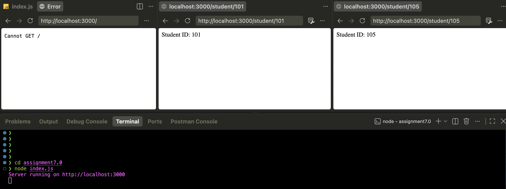
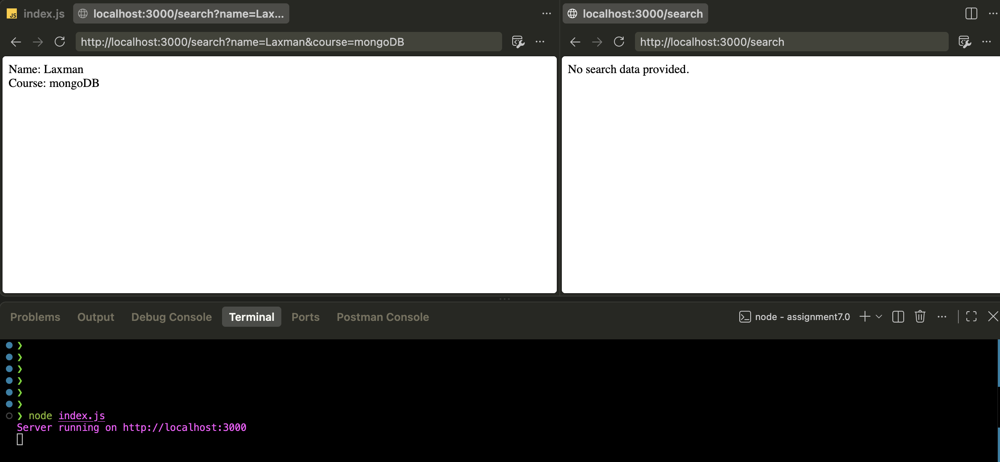
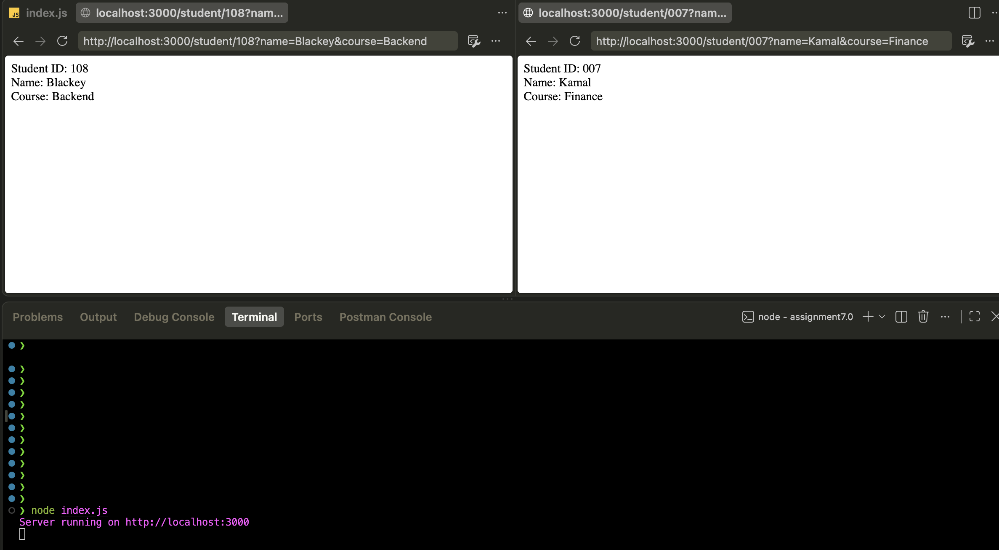

# Assignment 7.0 – Express.js Route & Query Parameters

Three Express.js exercises demonstrating dynamic routing with route parameters, data retrieval with query parameters, and a combined implementation that uses both together to build a simple student profile lookup.

## Overview

This project explores two of the most fundamental ways an Express.js application receives dynamic input from a client: **route parameters** (`req.params`) and **query parameters** (`req.query`). Each assignment isolates a concept, and the third assignment combines both to simulate a more realistic use case — looking up a student by ID while optionally accepting additional profile details through the query string.

## Objectives

- Understand how route parameters allow a single route definition to handle many dynamic values.
- Understand how query parameters allow optional, key-value data to be passed via the URL.
- Learn the syntax and use cases for `req.params` and `req.query`.
- Combine route parameters and query parameters within a single route.
- Handle the case where expected query parameters are missing.


## Technologies Used

- Node.js
- Express.js
- JavaScript

## Project Structure

```
assignment7.0/
│
├── screenshots/
│   ├── query_p.png
│   ├── route_p.png
│   └── student_p.png
│
├── query_p.js
├── route_p.js
└── student_p.js
```

Each assignment is self-contained in its own file, with no shared router or shared `package.json` between them.

## Assignment 1 — Route Parameters

**File:** `route_p.js`

**Purpose:** Demonstrates how to define a dynamic route segment in Express and read its value using `req.params`.

**Concept demonstrated:** Route parameters (also called URL parameters) let a single route definition respond to many different values by capturing a placeholder segment in the URL path.

**Route:** `/student/:id`

**Parameters involved:**

| Parameter | Source | Accessed via |
|---|---|---|
| `id` | URL path segment | `req.params.id` |

**Example URL:**
```
http://localhost:3000/student/101
```

**Expected browser output:**
```
Student ID: 101
```

**Relevant Express concept:** `req.params` is an object containing properties mapped to the named route "parameters." The colon (`:`) in the route definition (`:id`) tells Express to treat that segment as a variable rather than a fixed string.

## Assignment 2 — Query Parameters

**File:** `query_p.js`

**Purpose:** Demonstrates how to read optional key-value data appended to a URL after a `?` using `req.query`.

**Concept demonstrated:** Query parameters allow a client to send additional, optional, non-positional data to a route without changing the route path itself.

**Route:** `/search`

**Parameters involved:**

| Parameter | Source | Accessed via |
|---|---|---|
| `name` | Query string | `req.query.name` |
| `course` | Query string | `req.query.course` |

**Example URL:**
```
http://localhost:3000/search?name=Ricky&course=Node.js
```

**Expected browser output:**
```
Name: Ricky
Course: Node.js
```

**No query parameters provided:**
```
http://localhost:3000/search
```
**Expected browser output:**
```
No search data provided.
```

**Relevant Express concept:** `req.query` is an object populated from the query string portion of the URL (everything after the `?`). Unlike route parameters, query parameters are optional by nature and the application must account for their possible absence.

## Assignment 3 — Student Profile (Route Parameters & Query Parameters Combined)

**File:** `student_p.js`

**Purpose:** Demonstrates a realistic scenario where a required identifier is captured via a route parameter while supplementary, optional information is captured via query parameters — combining the concepts from Assignments 1 and 2 in a single route.

**Concept demonstrated:** A route can use `req.params` and `req.query` simultaneously; they serve different purposes and are read independently from the same incoming request.

**Route:** `/student/:id`

**Parameters involved:**

| Parameter | Source | Accessed via |
|---|---|---|
| `id` | URL path segment | `req.params.id` |
| `name` | Query string | `req.query.name` |
| `course` | Query string | `req.query.course` |

**Example URL:**
```
http://localhost:3000/student/101?name=John&course=FullStack
```

**Expected browser output:**
```
Student ID: 101
Name: John
Course: FullStack
```

## Route Parameters vs. Query Parameters

| | Route Parameters | Query Parameters |
|---|---|---|
| Location in URL | Path segment (e.g. `/student/101`) | After `?` (e.g. `?name=John`) |
| Syntax in route definition | `:paramName` | Not declared in the route path |
| Accessed via | `req.params` | `req.query` |
| Required or optional | Typically required — the route won't match without it | Typically optional |
| Best suited for | Identifying a specific resource (e.g. an ID) | Filtering, searching, or passing optional extra data |
| Used in this project | `route_p.js`, `student_p.js` | `query_p.js`, `student_p.js` |

## How the Application Works

Each file in this project is an independent Express.js server:

1. Express is initialized and a port (`3000`) is defined.
2. A route is registered using `app.get()` with either a static path (`/search`) or a dynamic path segment (`/student/:id`).
3. Inside the route handler, the relevant data is extracted:
   - `route_p.js` reads `req.params.id`.
   - `query_p.js` reads `req.query.name` and `req.query.course`, with a fallback message if neither is present.
   - `student_p.js` reads `req.params.id` together with `req.query.name` and `req.query.course`.
4. A plain text response is sent back to the browser reflecting the extracted values.
5. The server listens on `http://localhost:3000`.

## Setup & Installation

There is no `package.json` or `node_modules` included with these files. Express must be installed in the directory where you intend to run the scripts from:

```bash
npm init -y
npm install express
```

## How to Run

Each assignment is run independently, as they are separate files rather than routes on a shared server:

**Assignment 1 — Route Parameters:**
```bash
node route_p.js
```

**Assignment 2 — Query Parameters:**
```bash
node query_p.js
```

**Assignment 3 — Student Profile:**
```bash
node student_p.js
```

All three start a server at:
```
http://localhost:3000
```

> Note: Since all three files listen on the same port, only one should be run at a time unless the port is changed.

## Example URLs

| Assignment | Example URL |
|---|---|
| 1 — Route Parameters | `http://localhost:3000/student/101` |
| 2 — Query Parameters | `http://localhost:3000/search?name=Ricky&course=Node.js` |
| 2 — No Query Parameters | `http://localhost:3000/search` |
| 3 — Student Profile | `http://localhost:3000/student/101?name=John&course=FullStack` |

## Expected Outputs

| Request | Output |
|---|---|
| `GET /student/101` (route_p.js) | `Student ID: 101` |
| `GET /search?name=Ricky&course=Node.js` | `Name: Ricky` / `Course: Node.js` |
| `GET /search` | `No search data provided.` |
| `GET /student/101?name=John&course=FullStack` | `Student ID: 101` / `Name: John` / `Course: FullStack` |

## Testing

Each route was manually tested by starting the relevant server with `node <filename>.js` and visiting the example URLs above in a web browser. The resulting output was confirmed to match the expected output and captured in the corresponding screenshot.

## Screenshots / Proof of Execution

**1. Assignment 1 — Route parameters output**


**2. Assignment 2 — Query parameters output**


**3. Assignment 3 — Student profile (combined) output**


## Concepts Covered

- Express.js routing fundamentals
- Dynamic route segments with `:paramName`
- `req.params` for capturing path-based identifiers
- `req.query` for capturing optional key-value data from the URL
- Combining `req.params` and `req.query` in a single route
- Handling missing/optional query data with a fallback response

## Learning Outcomes

By completing this assignment, the following outcomes were achieved:

- Ability to define and read dynamic route segments in Express.
- Ability to define and read query string parameters in Express.
- Understanding of when to use a route parameter versus a query parameter based on whether the data is required to identify a resource or is optional/filtering data.
- Ability to combine both parameter types in a single route to model a more realistic API endpoint.


## Key Takeaways

- Route parameters are best suited for identifying a specific, required resource.
- Query parameters are best suited for optional, filtering, or supplementary data.
- A single Express route can use both mechanisms together without conflict.
- Always account for the possibility that optional query parameters may be absent.

