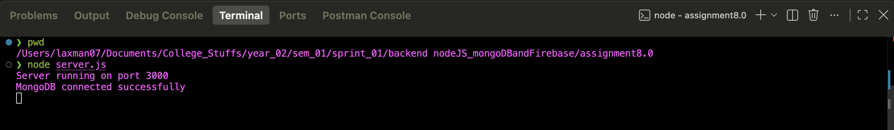
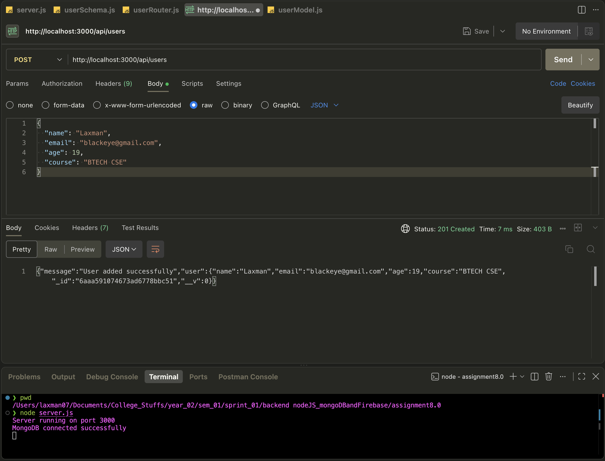
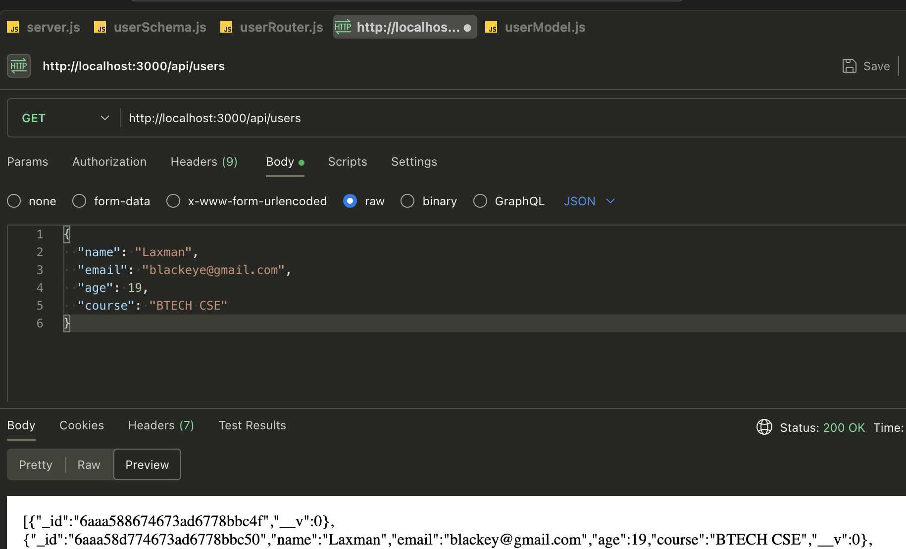
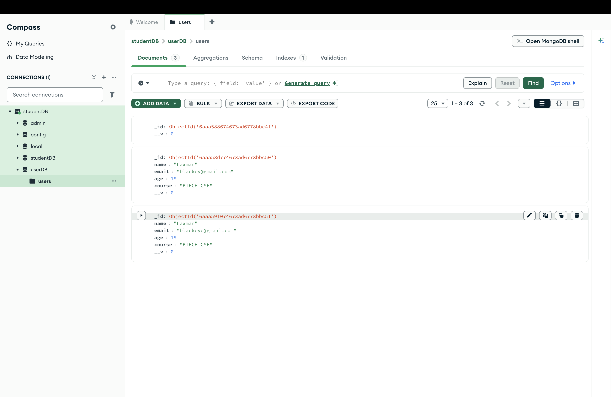

# Assignment 8.0 - Create and Retrieve Users Using Express, MongoDB and Mongoose

## 1. Overview

This project is an Express.js application that connects to a local MongoDB database using Mongoose. It exposes two REST API endpoints that allow a client to create a new user and retrieve all stored users. The application demonstrates a basic, structured approach to handling database operations in a Node.js backend by separating the schema, model, router, and server into distinct files.

## 2. Objective

The objective of this assignment is to understand how to integrate MongoDB with an Express.js application using Mongoose as the Object Data Modeling (ODM) library. This includes defining a schema, creating a model from that schema, building API routes to insert and fetch data, and verifying that the data is correctly persisted in the database.

## 3. Technologies Used

| Technology | Purpose |
|---|---|
| Node.js | JavaScript runtime for running the server |
| Express.js | Web framework used to build the REST API |
| MongoDB | NoSQL database used to store user data |
| Mongoose | ODM library used to model data and connect to MongoDB |
| Postman | Used to test the POST and GET API endpoints |
| MongoDB Compass | Used to visually verify data stored in MongoDB |

## 4. Project Structure

```
assignment8.0/
│
├── server.js
├── schema/
│   └── userSchema.js
├── model/
│   └── userModel.js
├── router/
│   └── userRouter.js
├── screenshots/
│   ├── mongoDB.png
│   ├── postman_get.png
│   ├── postman_post.png
│   └── terminal.png
└── Readme.md
```

**File and folder purpose:**

- `server.js` — Entry point of the application. Initializes Express, connects to MongoDB, registers middleware, and starts the server.
- `schema/userSchema.js` — Defines the structure and data types of a user document using Mongoose's `Schema` class.
- `model/userModel.js` — Compiles the schema into a Mongoose model, which is used to interact with the `users` collection in MongoDB.
- `router/userRouter.js` — Defines the API routes (`POST` and `GET`) and contains the logic for handling incoming requests.
- `screenshots/` — Contains proof-of-execution images for the terminal output, Postman requests, and MongoDB Compass verification.

## 5. Application Architecture

The application follows a simple layered flow, where each layer has a single responsibility:

```
Client/Postman
    → Express Server
        → Router
            → Mongoose Model
                → MongoDB
```

**Responsibility of each layer:**

- **Server** — Sets up the Express application, applies middleware, connects to the database, and mounts the router.
- **Router** — Receives incoming HTTP requests and directs them to the correct handler logic based on the route and method.
- **Model** — Acts as the interface between the router and MongoDB, built from the schema, and used to create or fetch documents.
- **Schema** — Defines what fields a user document should have and their data types.
- **Database (MongoDB)** — Physically stores the user data as documents inside a collection.

This layered structure keeps the database logic, route logic, and data definition separate, making the application easier to understand and maintain.

## 6. MongoDB Database

MongoDB is used as the database for this project, and Mongoose is used to connect the Node.js/Express application to it. Mongoose provides schema-based modeling, which allows the application to define a fixed structure for otherwise schema-less MongoDB documents.

- **Database name:** `userDB`
- **Collection name:** `users`
- **Data stored:** Basic user profile information, including name, email, age, and course.

When the server starts, Mongoose establishes a connection to the local MongoDB instance. A successful connection logs a confirmation message to the terminal, and any connection failure logs an appropriate error message.

## 7. User Schema

The user schema, defined in `schema/userSchema.js`, contains the following fields:

| Field | Type | Description |
|---|---|---|
| name | String | User's name |
| email | String | User's email |
| age | Number | User's age |
| course | String | User's course |

## 8. API Endpoints

| Method | Endpoint | Purpose |
|---|---|---|
| POST | `/api/users` | Add a new user |
| GET | `/api/users` | Retrieve all users |

### POST /api/users

- **URL:** `http://localhost:3000/api/users`
- **Method:** `POST`
- **Request Body:** JSON object containing `name`, `email`, `age`, and `course`
- **Purpose:** Accepts user data from the request body and stores it as a new document in the `users` collection.

**Example Request:**

```json
{
  "name": "Rahul",
  "email": "rahul@gmail.com",
  "age": 22,
  "course": "MCA"
}
```

**Example Success Response:**

```json
{
  "message": "User created successfully",
  "user": {
    "_id": "651f1e2b8f1b2c001c8e4a1a",
    "name": "Rahul",
    "email": "rahul@gmail.com",
    "age": 22,
    "course": "MCA",
    "__v": 0
  }
}
```

### GET /api/users

- **URL:** `http://localhost:3000/api/users`
- **Method:** `GET`
- **Purpose:** Retrieves all user documents currently stored in the `users` collection and returns them as a JSON array.

**Example Response:**

```json
[
  {
    "_id": "651f1e2b8f1b2c001c8e4a1a",
    "name": "Rahul",
    "email": "rahul@gmail.com",
    "age": 22,
    "course": "MCA",
    "__v": 0
  },
  {
    "_id": "651f1f0c8f1b2c001c8e4a1b",
    "name": "Laxman",
    "email": "blackeye@gmail.com",
    "age": 19,
    "course": "BTECH CSE",
    "__v": 0
  }
]
```

The `_id` field is a unique identifier automatically generated by MongoDB for every document. The `__v` field is a version key automatically added by Mongoose to track document revisions internally; it does not need to be set or read manually.

## 9. Installation and Setup

1. Open the project folder (`assignment8.0`).
2. Initialize npm, if not already done:

   ```bash
   npm init -y
   ```

3. Install the required dependencies:

   ```bash
   npm install express mongoose
   ```

4. Ensure MongoDB is running locally on the default port.
5. Start the application:

   ```bash
   node server.js
   ```

**Expected terminal output:**

```
Server running on port 3000
MongoDB connected successfully
```

## 10. Testing With Postman

### POST Request

**URL:**
```
http://localhost:3000/api/users
```

**Body type:** raw → JSON

**Example Body:**

```json
{
  "name": "Laxman",
  "email": "blackeye@gmail.com",
  "age": 19,
  "course": "BTECH CSE"
}
```

A successful request returns a success message along with the newly inserted user document, including the MongoDB-generated `_id`.

### GET Request

**URL:**
```
http://localhost:3000/api/users
```

Sending this request returns all users currently stored in the database as a JSON array.


## 12. Screenshots Included

The following screenshots are included as proof of execution:

- `screenshots/terminal.png` — Shows the server startup output and successful MongoDB connection message.
- `screenshots/postman_post.png` — Shows a successful POST request in Postman with the inserted user response.
- `screenshots/postman_get.png` — Shows a successful GET request in Postman returning the list of stored users.
- `screenshots/mongoDB.png` — Shows the inserted user data verified inside MongoDB Compass.






## 13. Request-Response Flow

**POST Flow:**
```
Postman → Express → userRouter → User Model → MongoDB → Response
```

**GET Flow:**
```
Postman → Express → userRouter → User Model → MongoDB → JSON Response
```

## 14. Error Handling

- If the application fails to connect to MongoDB, an appropriate error message is logged instead of the success confirmation.
- If an error occurs while inserting a user through the POST endpoint, an error response is returned instead of the success response.
- If an error occurs while retrieving users through the GET endpoint, an error response is returned instead of the user list.


## 16. Conclusion

This assignment demonstrates basic CRUD-related database interaction by implementing create and retrieve operations for user data using Express, Mongoose, and MongoDB. The project shows how a schema, model, and router can be organized into separate files to build a clean and maintainable API, with data persistence verified through both Postman and MongoDB Compass.