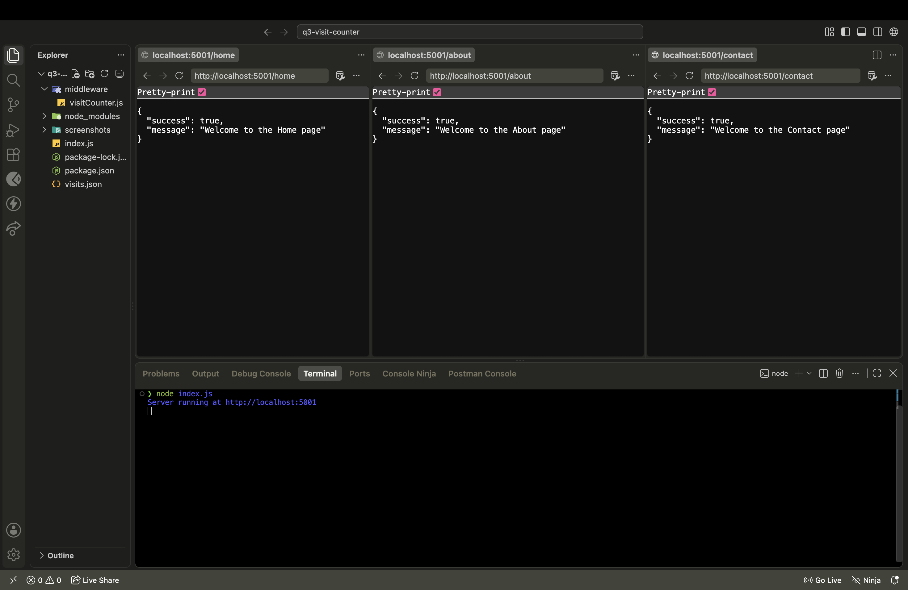
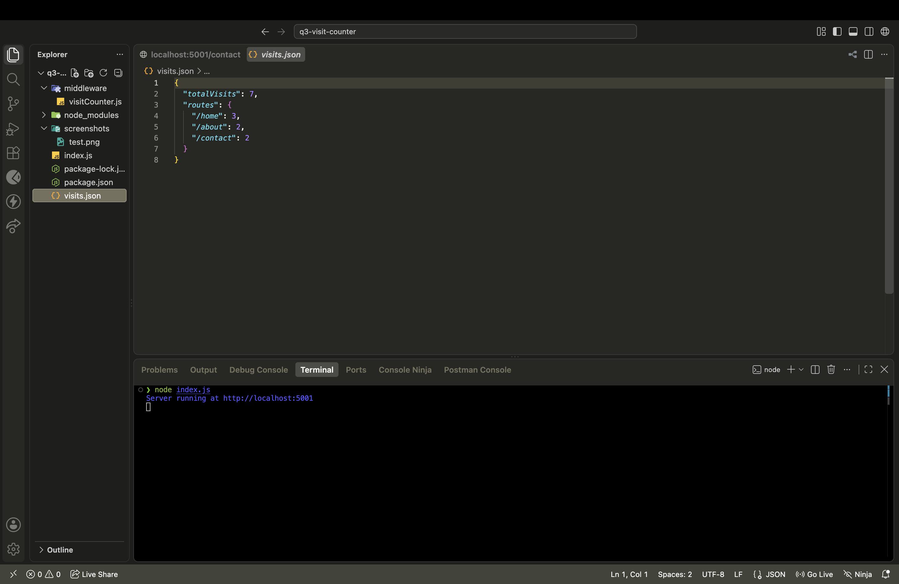
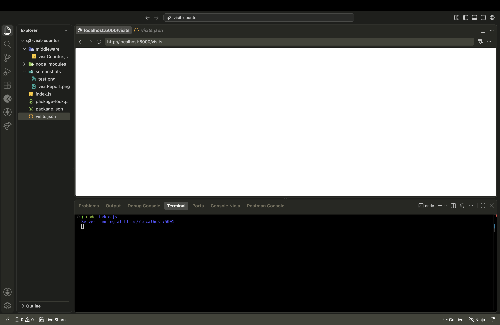

# Q3 - Count Page Visits Using Express Middleware

## 1. Overview

This project is an Express.js application that demonstrates how custom middleware can be used to track and persist page visit counts without a database. The application exposes three page routes (`/home`, `/about`, `/contact`) and one statistics route (`/visits`). A single custom middleware function intercepts requests to the page routes, increments the relevant counters, and writes the updated counts to a JSON file (`visits.json`) so that the data survives a server restart. The `/visits` route itself is intentionally excluded from this middleware so that checking the statistics does not affect the statistics.

## 2. Objective

The objective of this assignment is to understand:

- What Express middleware is and how it fits into the request-response cycle.
- How a middleware function executes before a route handler.
- How the same middleware can be reused across multiple routes instead of duplicating logic.
- How middleware can perform shared logic (visit counting) on behalf of several endpoints.
- How file-based persistence (a JSON file) can be used to store state instead of a database.

## 3. Technologies Used

| Technology | Purpose |
|---|---|
| Node.js | JavaScript runtime for running the server |
| Express.js | Web framework used to build the routes and middleware |
| Node's built-in `fs` module | Reading and writing `visits.json` |
| JSON file (`visits.json`) | Persistent storage for visit counts (no database used) |
| Postman / Thunder Client / Browser | Used to test the GET endpoints |

## 4. Project Structure

```
q3-visit-counter/
│
├── index.js
├── middleware/
│   └── visitCounter.js
├── visits.json
├── package.json
├── screenshots/
│   ├── test.png
│   ├── visitReport.png
│   └── visitTest.png
└── README.md
```

`node_modules/` and `package-lock.json` may exist locally but are not part of the submitted project files.

## 5. File and Folder Purpose

- **`index.js`** — Main Express application entry point. Imports Express and the custom visit-counting middleware, defines the `/home`, `/about`, and `/contact` routes (using the middleware), defines the `/visits` route (without the middleware), and starts the server.
- **`middleware/visitCounter.js`** — Contains the custom Express middleware responsible for all visit-counting logic: reading `visits.json`, updating the counts, writing the file back, and calling `next()`. All counting logic lives here and nowhere else.
- **`visits.json`** — Persistent storage file for the visit statistics. Holds `totalVisits` and a `routes` object mapping each page route to its individual count.
- **`package.json`** — Project metadata and dependencies (Express.js). `fs` is a built-in Node module and does not need to be installed separately.
- **`screenshots/`** — Contains proof-of-execution images for route testing, visit statistics, and the `/visits` exclusion test.

## 6. Application Architecture

**Flow for a counted route (`/home`, `/about`, `/contact`):**

```
Client
  → Express Route
      → visitCounter Middleware
          → Read visits.json
          → Increment totalVisits
          → Increment route-specific count
          → Write visits.json
          → next()
              → Route Handler
                  → JSON Response
```

**Flow for `/visits`:**

```
Client
  → GET /visits
      → Read visits.json
      → Return statistics
      → (No counting middleware attached)
      → Counts remain unchanged
```

The `/visits` route deliberately skips the middleware because it only reports statistics — it does not represent a "page visit" that should itself be counted. Attaching the middleware to `/visits` would cause every statistics check to inflate `totalVisits`, making the reported numbers inaccurate.

## 7. Persistent Data Storage

Visit data is stored in `visits.json` rather than in an in-memory JavaScript variable, so counts are not lost when the server restarts.

**Initial content:**

```json
{
  "totalVisits": 0,
  "routes": {}
}
```

**Example content after some page visits:**

```json
{
  "totalVisits": 15,
  "routes": {
    "/home": 5,
    "/about": 7,
    "/contact": 3
  }
}
```

If a route has not been visited before, it is added to the `routes` object with an initial count of `1`. Otherwise, its existing count is incremented by `1`.

## 8. Middleware Explanation

In Express, **middleware** is a function that has access to the request (`req`), the response (`res`), and a `next` function, and executes during the request-response cycle *before* the final route handler runs. Calling `next()` passes control forward to the next middleware or to the route handler; without it, the request would hang.

**`middleware/visitCounter.js`** is registered on the `/home`, `/about`, and `/contact` routes. Each time one of these routes is hit, the middleware:

1. Reads and parses `visits.json`.
2. Increments `totalVisits` by 1.
3. Increments the count for the requested route (creating it with a value of `1` if it doesn't already exist).
4. Writes the updated data back to `visits.json`.
5. Calls `next()` so the request continues to the actual route handler, which returns the page's JSON response.

The same middleware function is reused across all three page routes rather than duplicated — this keeps the counting logic in a single, maintainable location and satisfies the assignment requirement that counting logic exist only inside the middleware, not inside the route handlers.

`/visits` does **not** use this middleware, since its purpose is to report the stored statistics, not to generate a new visit.

## 9. API Endpoints

| Method | Endpoint | Middleware | Counted? | Purpose |
|--------|----------|------------|----------|---------|
| GET | `/home` | `visitCounter` | Yes | Return the Home page response and increment visit counts |
| GET | `/about` | `visitCounter` | Yes | Return the About page response and increment visit counts |
| GET | `/contact` | `visitCounter` | Yes | Return the Contact page response and increment visit counts |
| GET | `/visits` | None | No | Return current visit statistics without affecting them |

### GET /home

- **URL:** `http://localhost:3000/home`
- **Counted:** Yes

```json
{
  "success": true,
  "message": "Welcome to the Home page"
}
```

### GET /about

- **URL:** `http://localhost:3000/about`
- **Counted:** Yes

```json
{
  "success": true,
  "message": "Welcome to the About page"
}
```

### GET /contact

- **URL:** `http://localhost:3000/contact`
- **Counted:** Yes

```json
{
  "success": true,
  "message": "Welcome to the Contact page"
}
```

### GET /visits

- **URL:** `http://localhost:3000/visits`
- **Counted:** No — this endpoint is intentionally excluded from the counting middleware

```json
{
  "success": true,
  "data": {
    "totalVisits": 15,
    "routes": {
      "/home": 5,
      "/about": 7,
      "/contact": 3
    }
  }
}
```

> The server listens on port `3000` by default in the examples above. Update this if `index.js` configures a different port.

## 10. Installation and Setup

1. Open the project folder (`q3-visit-counter`).
2. Install dependencies:

   ```bash
   npm install
   ```

3. Start the application:

   ```bash
   node index.js
   ```

`node_modules/` is generated locally by `npm install` and is not part of the submitted/committed project.

## 11. Testing the Application

### Page Routes

Using a browser, Postman, or Thunder Client, send GET requests to `/home`, `/about`, and `/contact` and confirm each returns its expected JSON message.

### Visit Counter Testing (example scenario)

If the page routes are requested:

- `/home` — 5 times
- `/about` — 7 times
- `/contact` — 3 times

Then `GET /visits` should report:

```json
{
  "success": true,
  "data": {
    "totalVisits": 15,
    "routes": {
      "/home": 5,
      "/about": 7,
      "/contact": 3
    }
  }
}
```

(This is an example scenario from the assignment specification, not necessarily the exact numbers currently stored in `visits.json`.)

### Persistence Testing

1. Visit the page routes several times.
2. Open `/visits` and record the counts.
3. Stop the Node.js server.
4. Restart the server with `node index.js`.
5. Open `/visits` again and confirm the previously recorded counts are still present.

This confirms counts are stored in `visits.json` on disk, not just held in a JavaScript variable in memory.

### `/visits` Exclusion Testing

1. Open `/visits` and record `totalVisits` and each route's count.
2. Refresh `/visits` several times.
3. Open `/visits` again and confirm the values have not changed.

This confirms `/visits` is not passed through the `visitCounter` middleware.

## 12. Screenshots Included

- `screenshots/test.png` — Shows successful responses from all three page routes (`/home`, `/about`, `/contact`).
- `screenshots/visitReport.png` — Shows the visit statistics after testing the page routes, confirming that the stored counts match the requests made.
- `screenshots/visitTest.png` — Shows that repeatedly calling `/visits` does not increase the visit counts, confirming that `/visits` is excluded from the counting middleware.





## 13. Error Handling

The application is expected to handle basic failure conditions around the persistent storage file:

- If `visits.json` cannot be read or its contents cannot be parsed as valid JSON, the middleware should surface an error rather than silently corrupting the counters.
- If writing the updated counts back to `visits.json` fails, an appropriate error should be returned instead of a success response.
- The `/visits` route should return an error response if the file cannot be read, instead of returning stale or malformed data.

## 14. Important Assignment Rules Followed

- [x] `visits.json` is created with the required initial structure (`totalVisits: 0`, `routes: {}`).
- [x] `/home`, `/about`, and `/contact` each return the required response format.
- [x] A single custom middleware (`middleware/visitCounter.js`) handles all counting logic.
- [x] Every counted visit increments `totalVisits` and the specific route's count, creating the route entry with `1` if it's new.
- [x] `/visits` reads and returns the current statistics from `visits.json`.
- [x] `/visits` is **not** counted — repeated requests to it do not change `totalVisits` or any route's count.
- [x] Counts are persisted to `visits.json`, not held only in memory.
- [x] No database is used.
- [x] Counting logic exists only inside the middleware file.
- [x] Route handlers contain no visit-counting logic.

## 15. Submission Notes

The following should be included when submitting the project:

```
q3-visit-counter/
├── index.js
├── middleware/
├── visits.json
├── package.json
├── screenshots/
└── README.md
```

`node_modules/` should **not** be committed or submitted.

## 16. Conclusion

This assignment demonstrates how Express middleware can implement shared, cross-cutting logic — in this case, visit counting — while keeping route handlers focused solely on returning responses. By persisting counts to `visits.json` and deliberately excluding `/visits` from the counting middleware, the project shows both the reusability benefit of middleware and the importance of controlling exactly which requests trigger side effects.